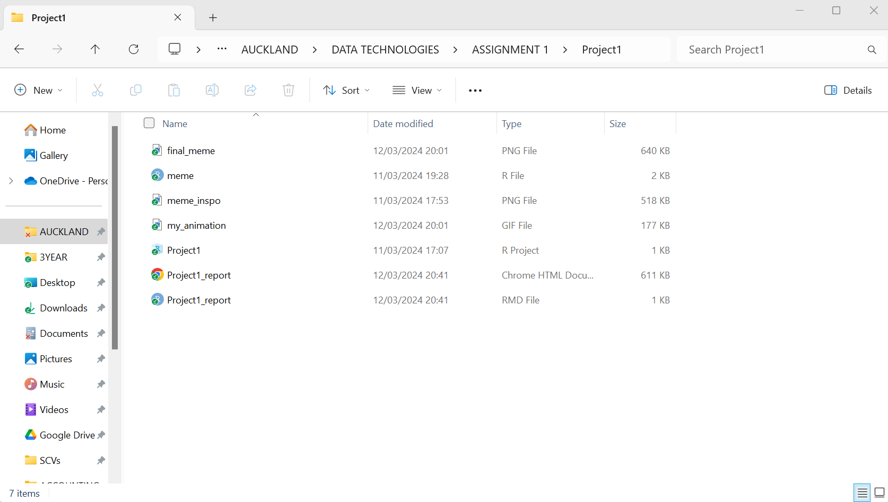
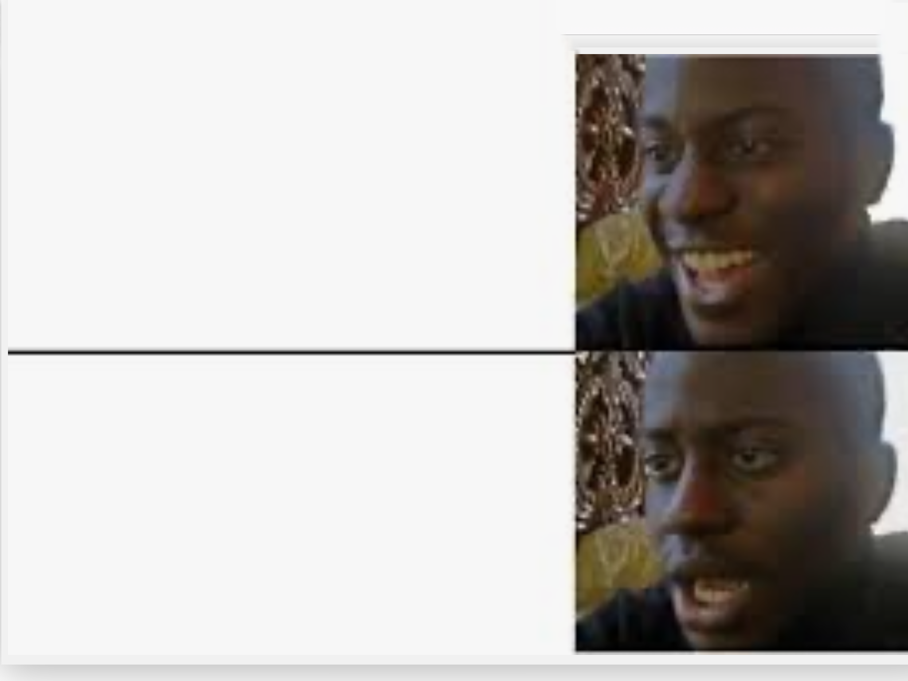
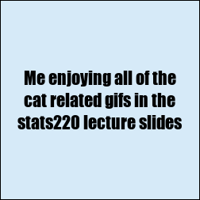

```{r setup, include = FALSE}
knitr::opts_chunk$set(echo=TRUE, message=FALSE, warning=FALSE, error=FALSE)
```

```{css, echo=FALSE}
body {
  font-family: 'Calibri';
  background-color: #c3e4e6;
  margin: auto;
  text-align: center;
}

h1 {
  font-size: 32px;
  color: #1a1b1c; 
}

h2 {
  font-size: 24px;
  color:#36393d;
}


p {
  color: #494d54;
}

code, pre {
  background-color: #ffffff; /* White background */
  padding: 10px;
  font-family: Courier;
}

pre {
  text-align: left;
  white-space: pre-wrap;
}
```

## Project requirements
In order to fulfill the requirements of the project, I set up a Github account using my UOA email address. I then created a repository names Stats220 within this account which includes a README.md file outlining the reasons why I created the repo. I have included a link to my repo [HERE](https://github.com/maxreidUOA/stats220) so feel free to give it a read! Overall, I found Github very easy and intuitive to use, I can definitely see why it was reccomended.

In order to keep all files related to the assignment in one place, I created an Rstudio Project as shown in the screenshot below. This folder contains all of the R, PNG, and GIF files I used throughout the creation of the meme and animation. This was very useful, as within the RStudio environment I was able to see each of these files and manage them accordingly.



## My meme
To get inspiration for my meme, I browsed the internet for a while (definitely didnt use this assignment as an excuse to chill out looking at memes in the library). Finally, I decided to use the below meme format as my inspiration. 

I liked the 4-panel format as it lended itself well to both the picture meme as well as the animated meme. I adapted this 4 panel format, using the left column for the text and the right column for the reactionary images. I used the same image as my inspo meme for the top right, but decided to change the bottom right image to one I found online in order for it to fit better with my allergic reaction-themed meme. I also changed the text of course, changing it to make my meme more personal to the class.
```{r meme-code, eval=TRUE}
library(magick)

inspo_url <- "https://i.kym-cdn.com/photos/images/newsfeed/001/542/779/172.jpg" #Link to the inspiration for my meme
#I will use the format shown but switch up the bottom picture as well as the text to create my own reaction meme (pun intended)

#creating the two text boxes of the meme
blank_box <- image_blank(width = 250, height = 250, color = "#D6EAF8")
text_box1 <- image_annotate(blank_box, 
                            text = "Me enjoying all of the\n cat related gifs in the \nstats220 lecture slides", 
                            size = 22, 
                            color = "black", 
                            gravity = "center",
                            font = "impact")%>%
  image_border("black", "1x1")

text_box2 <- image_annotate(blank_box, 
                            text = "Remembering I'm \nallergic to cats", 
                            size = 25, 
                            color = "black", 
                            gravity = "center",
                            font = "impact")%>%
  image_border("black", "1x1")

happy_image <- image_read("https://i.kym-cdn.com/photos/images/newsfeed/002/116/540/b21.jpg")
cropped_image <- image_crop(happy_image, "800x800+0+150") #The original image was rectangular so I had to crop it first to fit with the square size of the other images
happy_reaction <- image_scale(cropped_image, "250x250!") %>%
  image_border("black", "1x1")


allergic_image <- image_read("https://pbs.twimg.com/media/ETcqyFkWsAAzjzk?format=jpg&name=small")
allergic_reaction <- image_resize(allergic_image, "250x250")%>%
  image_border("black", "1x1")

top_row <- image_append(c(text_box1, happy_reaction))
bottom_row <- image_append(c(text_box2, allergic_reaction))

final_meme <- c(top_row, bottom_row) %>%
  image_append(stack = TRUE)
final_meme

image_write(final_meme, "final_meme.png")

```


```{r animation-code, eval=FALSE}
#Time to make it a gif!!!!

#importing new frames of the allergic reaction image

allergic_image2 <- image_read("https://i.ytimg.com/vi/c-g0ulv04qY/hqdefault.jpg")%>%
  image_scale("250x250!")%>%
  image_border("black", "1x1")


allergic_image3 <- image_read("https://i.ytimg.com/vi/xPM85MCgqXo/hqdefault.jpg")%>%
  image_scale("250x250!")%>%
  image_border("black", "1x1")

#making a more distorted version of the allergic reaction image for the final frame
allergic_image4 <- image_modulate(allergic_reaction, brightness = 75, saturation = 200,)
print(allergic_image4)


frames <- c(text_box1, happy_reaction, text_box2, allergic_image2,allergic_image3, allergic_reaction, allergic_image4)
animation <- image_animate(frames, fps = 0.5)
animation

#Saving the animation as a gif
image_write(animation, "my_animation.gif")

```

Find below the GIF I created using the previously shown code




## Creativity
I believe I demonstrated loads of creativity when creating my meme! Firstly, I made plentiful changes to the inspo meme, making it almost unrecognisable from how it began, changing almost everything about it apart from the image in the top right. I also thought it was creative to make a meta meme about the lectures (though im sure a few other people did this). I also used many magick functions that were not in the lab tasks, such as image_border, image_scale, and image_modulate to name a few. I used more CSS than was necessary in order to fully personalise my html document in a creative way. I was unsure if the css code was supposed to appear at the top of the HTML output, but I didnt like how it looked so I set echo=FALSE in the code. I also added a few more frames than needed to my animated meme in order to fully flesh it out.

## Learning reflection
I learned a lot in the short two weeks of Module 1, so it is difficult to narrow down to one idea. However, I did find it particularly fascinating how easy it was to import data (such as images) from the internet and alter/utilise them using R. This, combined with the ease of creating HTML documents using this software has opened my eyes to the endless possibilities of data technologies. 

In terms of further eploration, I a particularly interested in data collection and how this data can be categorised/analysed to tell a story/ solve a problem. I have found week 3's classes very interesting with the emphasis on dealing with users and the different restrictions you have to enforce in order to maximise the value of the data you collect.

